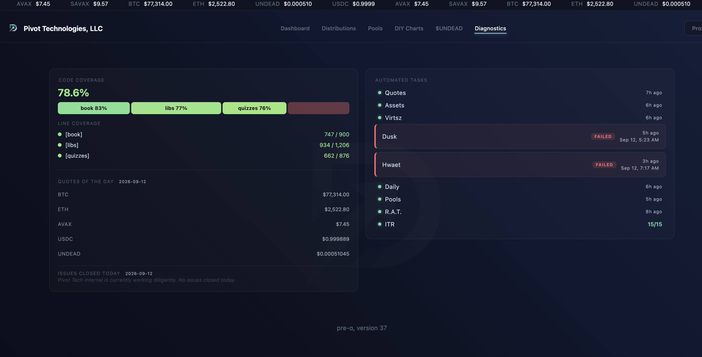
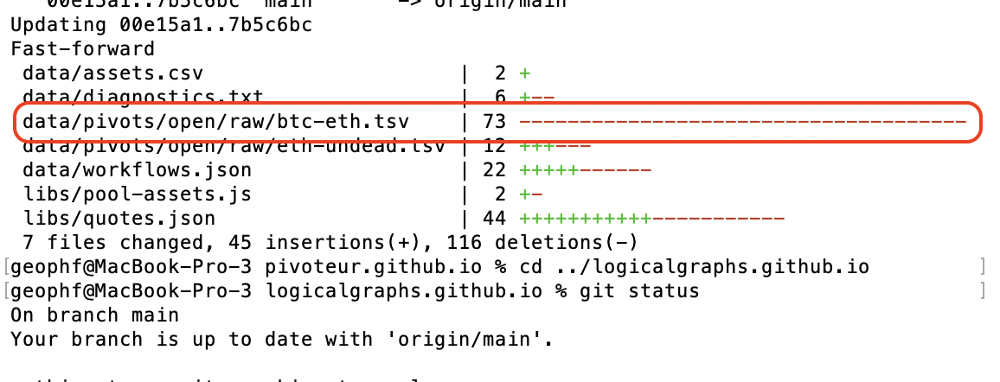

# dapp failures

HWÆT, pivoteurs, and well-met!

We have a couple of failures of protocol dapps: hwaet and dusk. Let's take a 
look-see what happened.

## `dusk`

For `dusk`, the error was 'empty list for data-set.' Looking at the data-sets 
updated last night, I see that the BTC+ETH pool has been wiped out.

I'll restore that pool's data (I have a local back-up), and see if that fixes 
the problem.

## `virtsz`

Deep dive: `virtsz` gets the path to the open pivot table to analyze but it 
also gets the protocol on which the pivot pool is being analyzed. The 
protocol-argument is redundant and confuses the dapp.

I'm [eliminating the 
protocol-argument](https://github.com/pivoteur/protocol/issues/269) from 
`virtsz`. 
