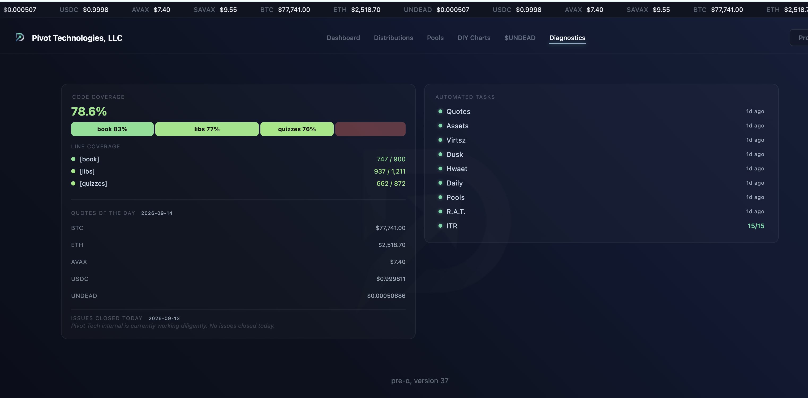
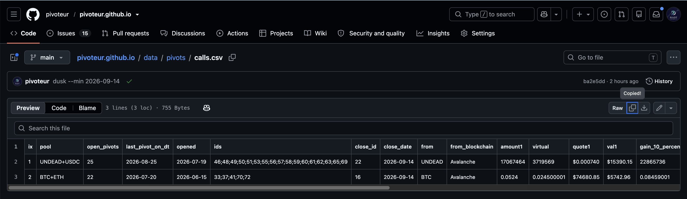

# Protocol health

HWÆT, pivoteurs, and well-met!

* Protocol health check: good
* There are 2 close-pivot calls.

# Automation

You don't know how reassuring a protocol health-check is. Sure, I could do a 
manual health-check, but this automation saves a lot of time. 

For example, the close-pivot calls used to take an hour per pivot-pool to 
check manually, and I have seven pivot pools. Automation does it for me, well: 
automatically, saving seven hours per work-day (1 hr saved/pool/day).
