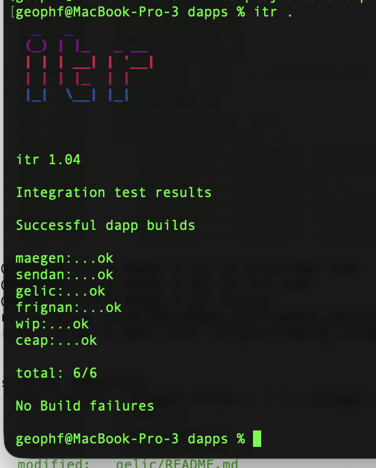
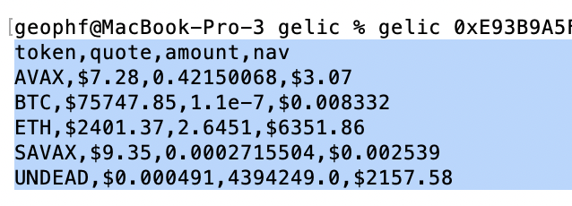
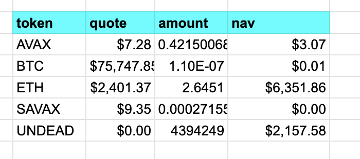

# automation

HWÆT, pivoteurs, and well-met!

I have a set of tools built, thanks to @ParisBrand32180, to help with 
automated trading.

Today, I'll use these tools to work on pivot arbitrage.

A mixture of automation and, well: 'manualation' (?).

# Cast wallet

Before I do that, I need to create a wallet for trading and grant permissions 
to trade on that wallet.

[Instructions
here](https://github.com/pivoteur/trading/tree/main/dapps#cast-wallet)

# `gelic`

First automation tool: 

* [gelic](https://github.com/pivoteur/trading/tree/main/dapps/gelic)

which reads wallet balances.
