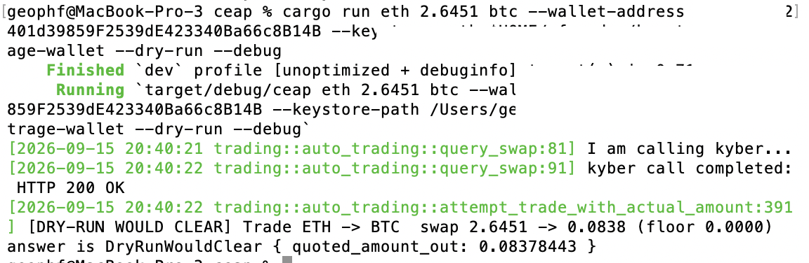
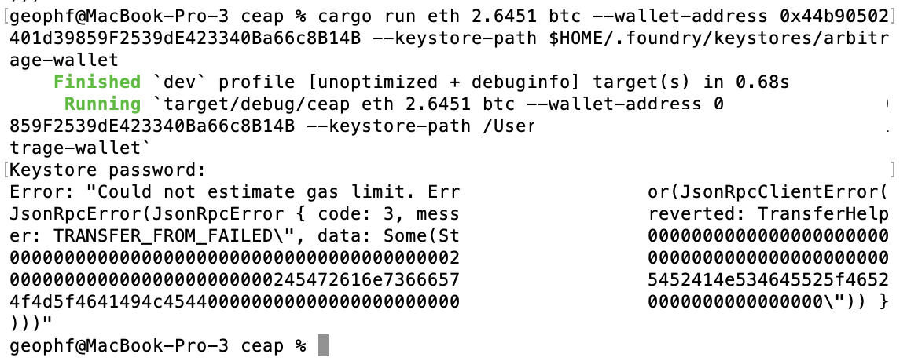
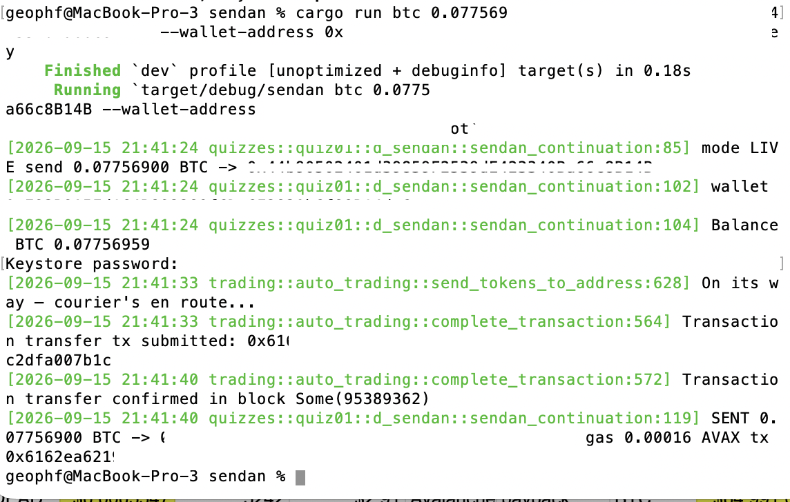

# automation

HWÆT, pivoteurs, and well-met!

I have a set of tools built, thanks to @ParisBrand32180, to help with 
automated trading.

Today, I'll use these tools to work on pivot arbitrage.

A mixture of automation and, well: 'manualation' (?).

# Cast wallet

Before I do that, I need to create a wallet for trading and grant permissions 
to trade on that wallet.

[Instructions
here](https://github.com/pivoteur/trading/tree/main/dapps#cast-wallet)

# `gelic`

First automation tool: 

* [gelic](https://github.com/pivoteur/trading/tree/main/dapps/gelic)

which reads wallet balances.

# `ceap`

I go to trade ETH for BTC for a pivot, but the dapp that does that, `ceap` 
(pronounced: 'cart'), throws an error, saying that it can't estimate gas.

I've [opened an issue](https://github.com/pivoteur/trading/issues/86)
addressing this.

# `sendan`

After doing a manual swap for the pivot, I attempt to send the tokens to 
storage, using the dapp 

* [ `sendan` ](https://github.com/pivoteur/trading/tree/main/dapps/sendan)

The first time I used the dapp it failed, but here it worked.

Maybe I fat-fingered a wallet address incorrectly?

Anyway, `sendan` works fine!

