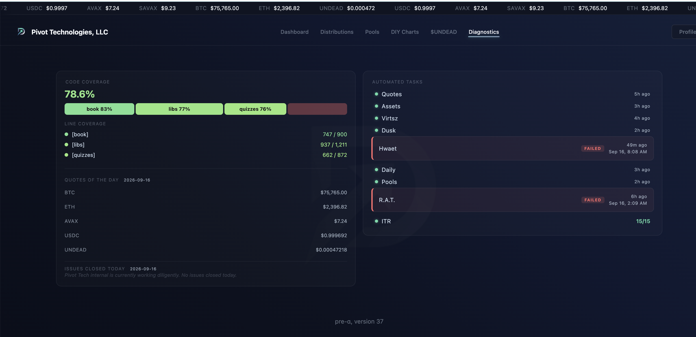
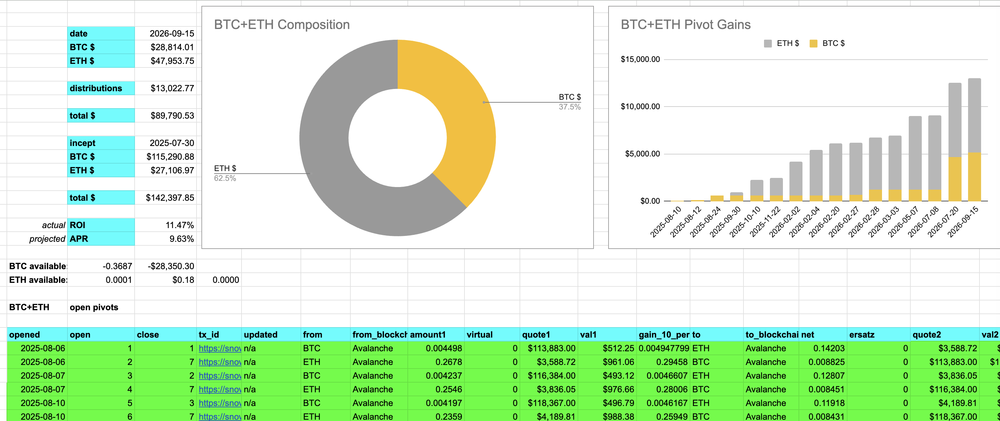
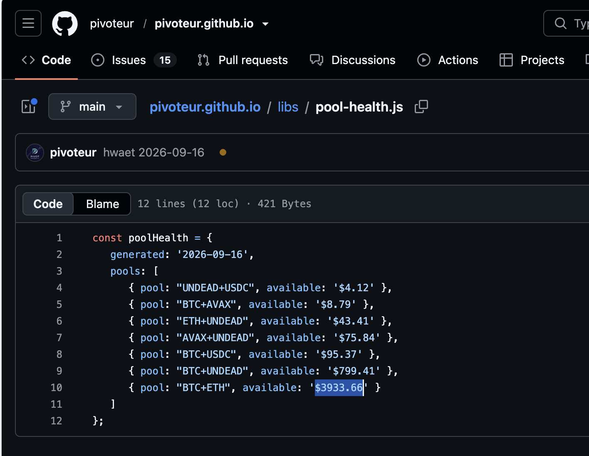

# `hwaet`

HWÆT, pivoteurs, and well-met!

Automation this morning shows a `hwaet` (pool health) failure. I dug into this 
and it shows I've overcommitted 0.37 BTC into pivots.

Why? An investor withdrew as much, and I accounted for this after I pivoting.

No problem. I'll adjust pivots now.

## Adjustment

After adjusting the pivots, `hwaet` now runs successfully.

Not only that, but $3,900 of BTC-liquidity is 'discovered' in the 
adjustment-process, which is cool!

Let's pivot that liquidity with automations to do that ([issue to create 
automations](https://github.com/pivoteur/trading/issues/88)).

