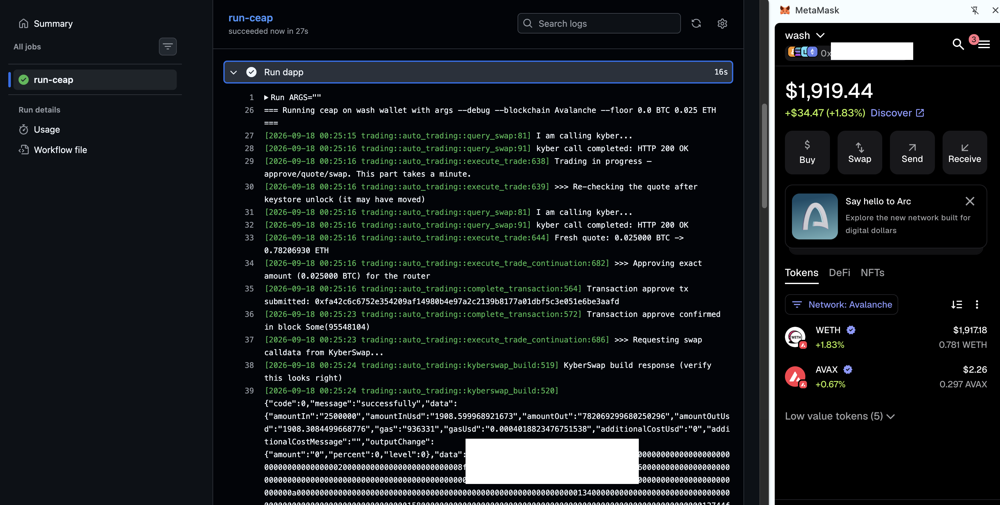

# Automation

HWÆT, pivoteurs, and well-met!

Automation continues a-pace.

* [ `sendan` ](https://github.com/pivoteur/trading/actions/workflows/sendan-bot.yml)

sends tokens from its assocated wallet to another wallet.

I sent BTC to the `wash` wallet to open a new pivot.

To open a pivot, I need a trader-dapp, `ceap` (pronounced 'cart').

# `ceap`

Whilst automating `ceap` I came across a defect:

When I put a floor on the trade, the trade fails, even when the proposed-trade 
surpasses the floor.

I've [created an issue](https://github.com/pivoteur/trading/issues/107), 
and proceeded with no floor set.
