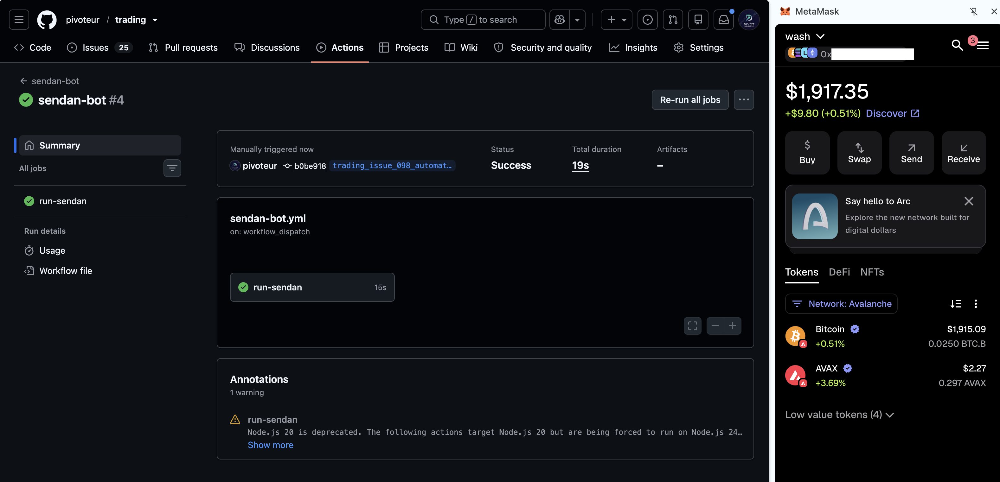

# Automation

HWÆT, pivoteurs, and well-met!

Automation continues a-pace.

* [ `sendan` ](https://github.com/pivoteur/trading/actions/workflows/sendan-bot.yml)

sends tokens from its assocated wallet to another wallet.

I sent BTC to the `wash` wallet to open a new pivot.

To open a pivot, I need a trader-dapp, `ceap` (pronounced 'cart').

