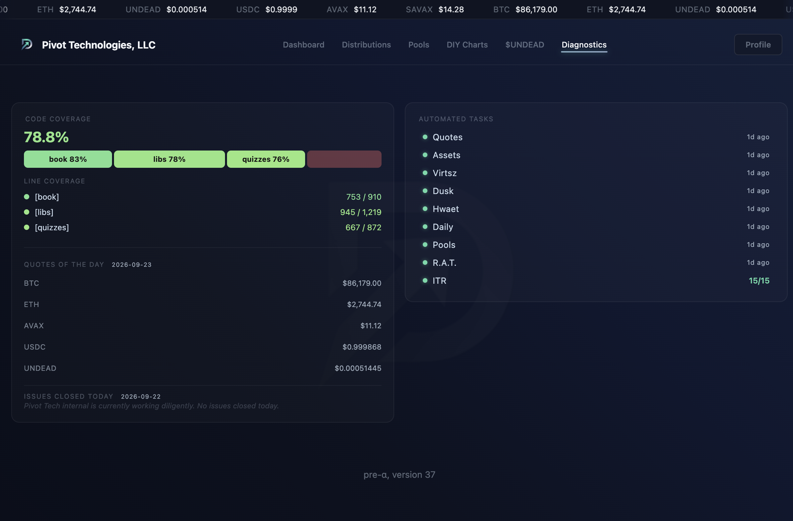
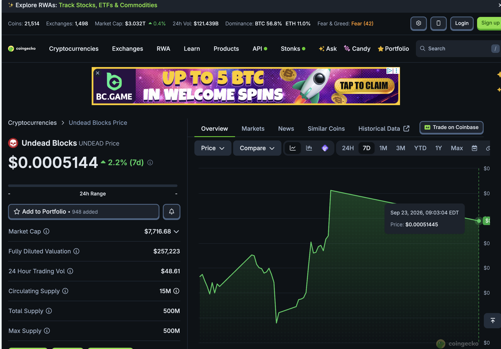
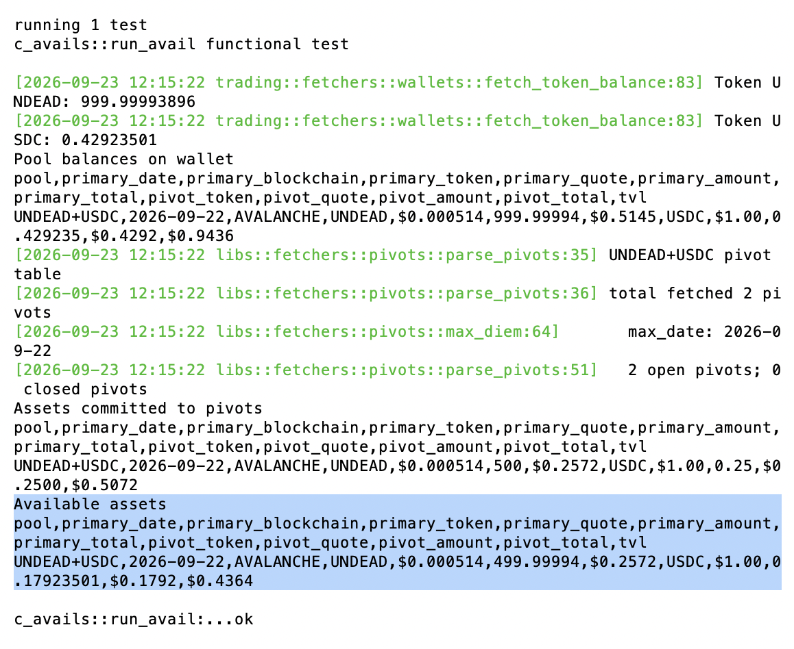

# Hand-crafted love

Meanwhile, the [Pivot Protocol](https://pivoteur.github.io/index.html), every 
piece is hand-crafted. Zero smart contracts.

... okay, somebody else wrote the Rust compiler, and somebody-else-else wrote 
git. I'll give you those points. 🤓  

# UNDEAD

HWÆT, pivoteurs, and well-met!

UNDEAD price-chart, last 7 days. 

# dapp
## Compute Available assets

Yesterday, there was [an issue of disparate representations of 
Blockchain](https://x.com/pivocateur/status/2102617282614886513). I resolved 
this issue and now I can accurately (and without error) compute assets 
available for pivoting in a pivot pool on a wallet.

[c_avails](https://github.com/pivoteur/trading/tree/main/quizzes/src/quiz02/c_avails)
