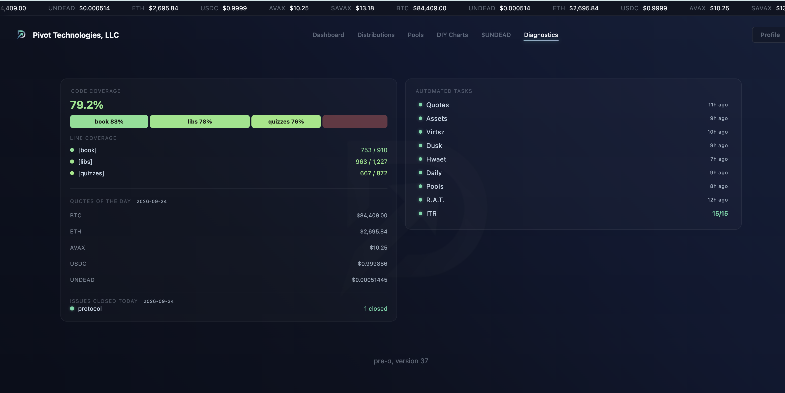
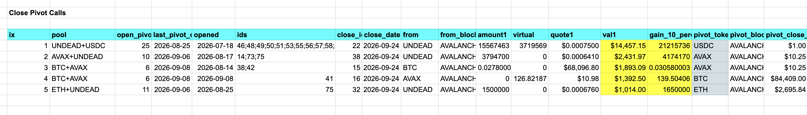
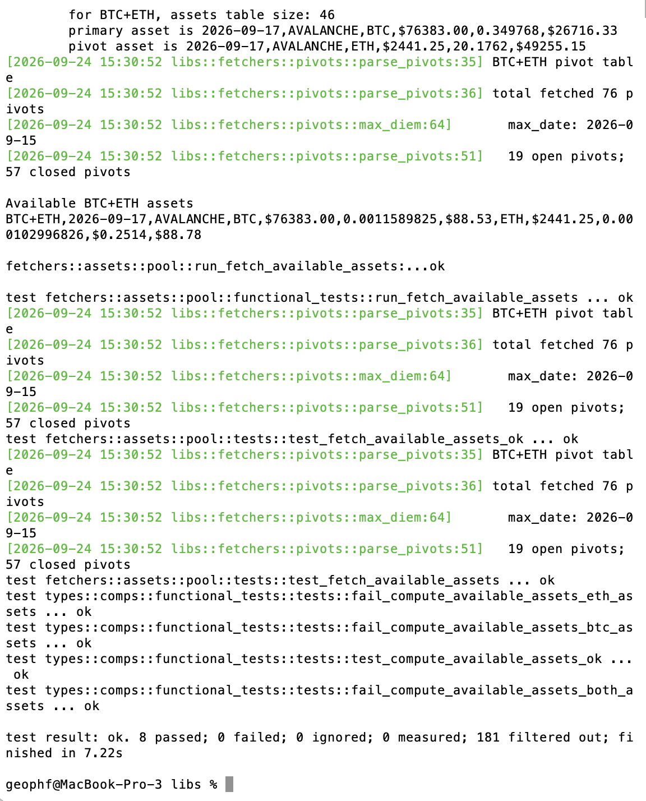
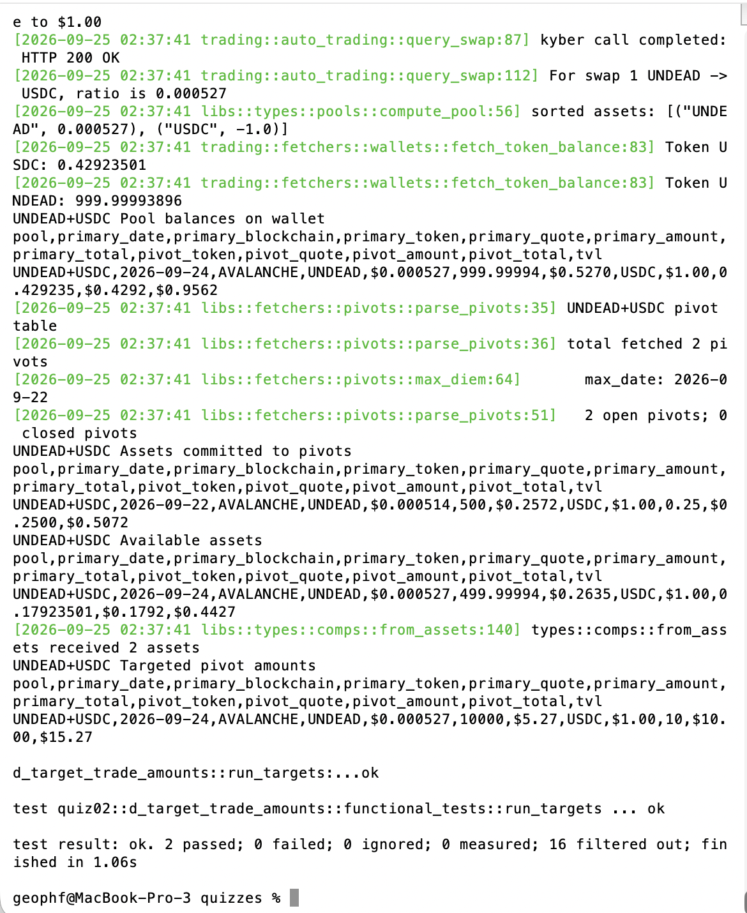

# Automation and testing

HWÆT, pivoteurs, and well-met!

I've migrated the 'available assets'-computation to the protocol repository, 
meaning that an open-pivot dapp is well-positioned to be created on the 
trading-protocol.

Calls will soon be automated!

You also see everything is fully-tested.

## Open pivot automation

We have the next step in open-pivot automation:

* current token-prices from the blockchain; and,
* target pivot amounts per token in the model

[source code](https://github.com/pivoteur/trading/tree/main/quizzes/src/quiz02/d_target_trade_amounts)
