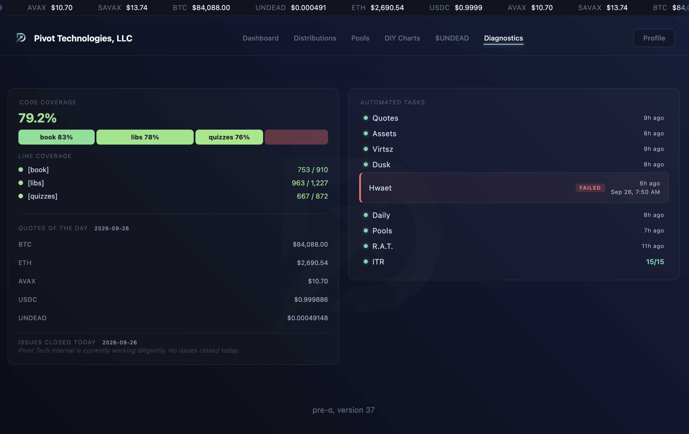

# Diagnostics

HWÆT, pivoteurs, and well-met!

The protocol diagnostics points out that `hwaet` failed (`hwaet` checks 
pool-health).

I'm looking into this issue now.

## Fixed

Fixed the issue, it was a mislabeling of a pivot, so it was a simple fix.

Protocol health restored. 
