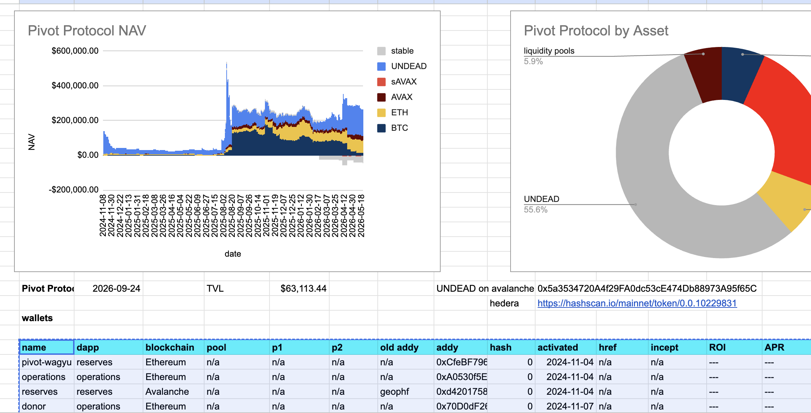
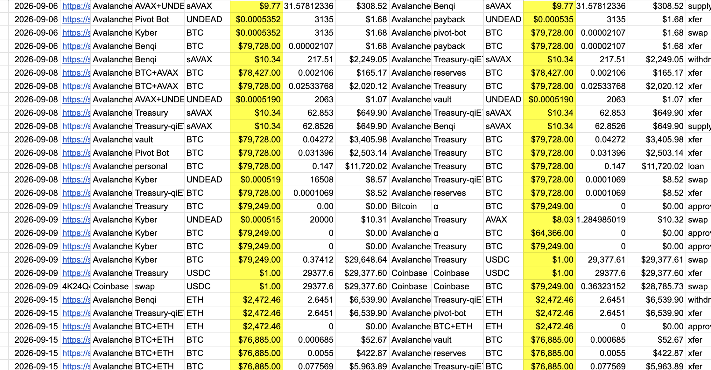
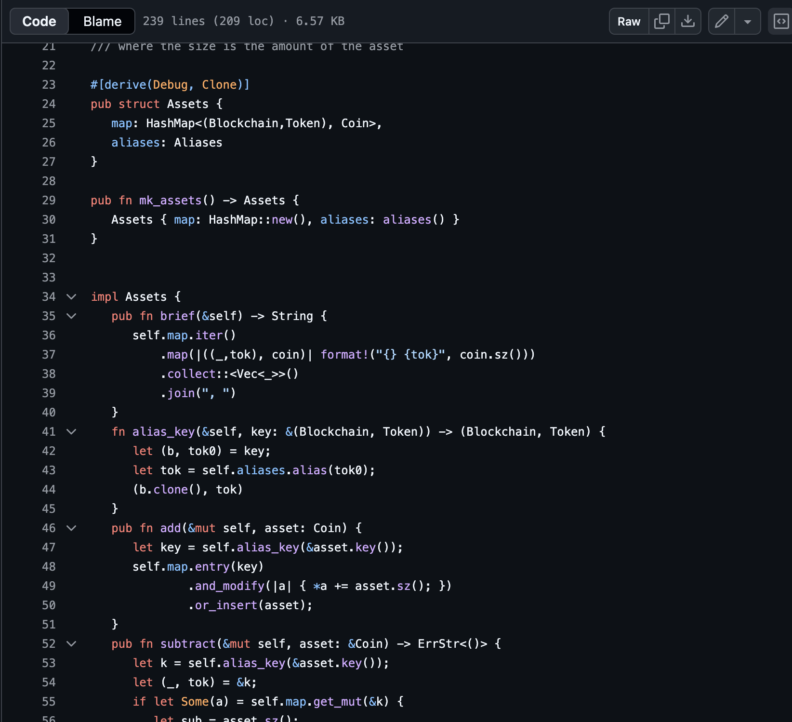
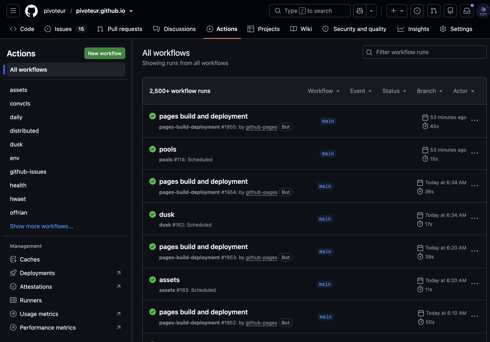
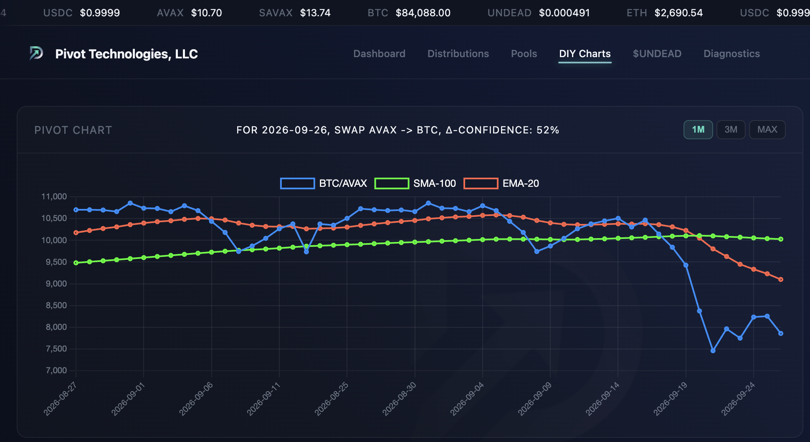
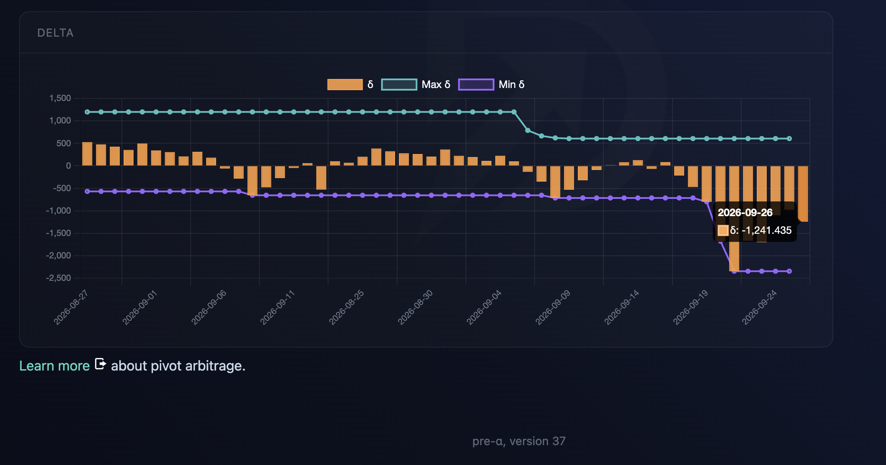
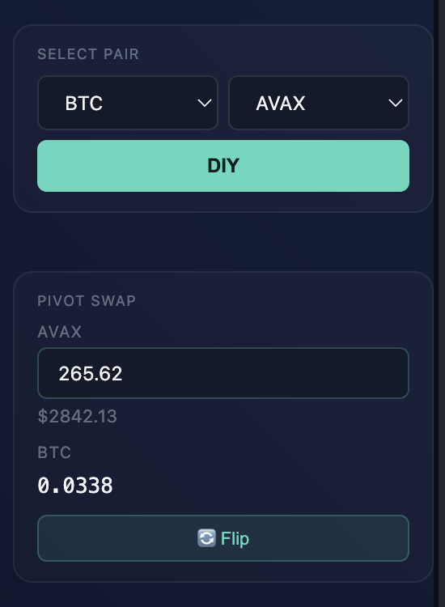
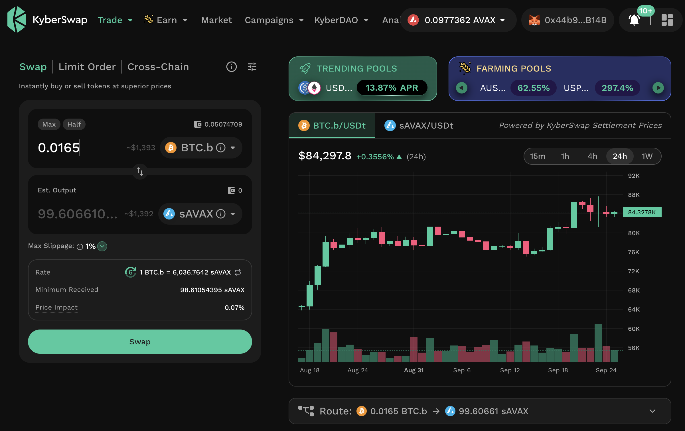

HWÆT, pivoteurs, and well-met!

[This](https://x.com/justinskycak/status/2103820379701526722).

> Justin Skycak @justinskycak

> You cannot optimize what you haven’t mastered manually. You haven’t earned 
the right to automate until you’ve felt the friction of the manual labor.

This is how I build, and how I am building, my company, spreadsheet after 
spreadsheet after spreadsheet after spreadsheet after Rust dapps after Github 
automation.

# PIVOTS

## BTC+AVAX

Let's open new BTC+AVAX pivots.

* I open an AVAX-on-BTC pivot
* I also open a BTC-on-AVAX hedge.

BTC/AVAX ratios and delta-indicators [shown and 
available](https://pivoteur.github.io/diy.html?t1=BTC&t2=AVAX).

You can run your own charts and do your own analyses with these tools, if 
you'd like.
