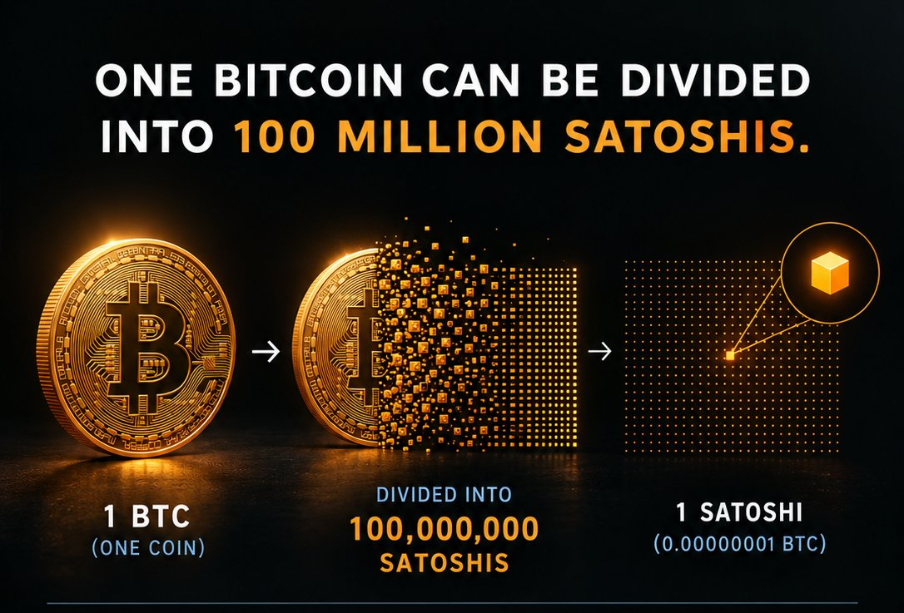
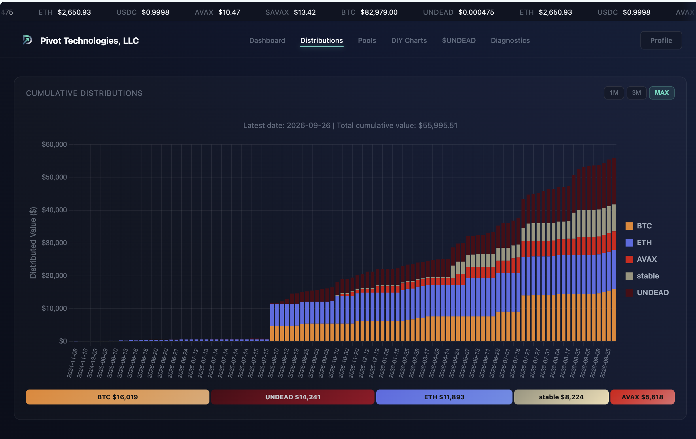

# BTC

Replying to [tweet](https://x.com/CaffeSatoshi/status/2104087588420120839):

People view BTC as this 'thing.'

I think that's a mistake of looking at BTC in a too-constrained way. BTC is, 
indeed, this 'thing.'

But, in a different way, so is [fiat] money.

Money is this 'thing.'

More than just having the 'thing,' is what you do with the 'thing.'

The 'thing' about these 'things' is that money, somebody else says, "Hey, 
this 'thing' is a 'thing,'" and they tell you what you can do, or not do, with 
it, and they can take it away.

With BTC, it's your 'thing.' You can keep it, lend it, borrow it, invest it, or 
buy a pizza.

I think, because BTC is a 'thing' and money and stocks are 'things,' people 
make the mistake of equating the former to the latters.

They're not equivalent.

Your BTC is YOUR BTC.

Your money, your house, your gold, are not. Somebody can take away the 
latters, but BTC is YOURS.

# Protocol health and distributions

HWÆT, pivoteurs, and well-met!

## More BTC

Do you like BTC?

Stupid question, I know.

But, if you like BTC, do you like MORE BTC?

That's what the Pivot Protocol does. It pivots assets from and to those 
assets, including BTC.

To date, we've distributed $56k in gains, including $16k in BTC

# Automation progress

`ceap` (pronounced 'cart'), a dapp that trades 'X' or 'Y' on the blockchain, 
works.

There was a period where `ceap` wasn't working. It could've been weird contract 
interactions with sAVAX on a DEX. I don't know.

I do know that `ceap` running makes me happy.
