# Libraries

HWÆT, pivoteurs, and well-met!

Yesterday, I was laying foundation.

Huh?

I noticed that I was doing some standard-y things with CSV, so I rolled-back 
that work into library-functionality.

I finished [that 
work](https://github.com/logicalgraphs/crypto-n-rust/issues/117) around midnight
last night. 

# Coding

Now, some may point out:

* Hey, isn't there a CSV-library for Rust, already?

The answer to that is: yes.

I've found programming is the art of finding out the code you just wrote to 
solve the problem is in somebody else's library already.

The trick is to find the library! 😎

# Fundamentals

A fundamental aspect of 'library improvements' or of closing any issue, 
generally, is:

* Does the system work after rolling out the changes?

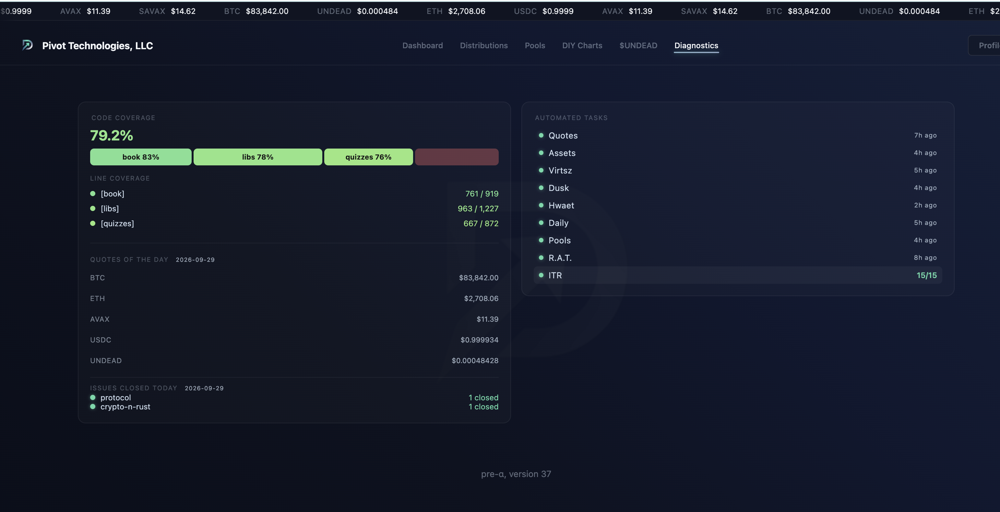
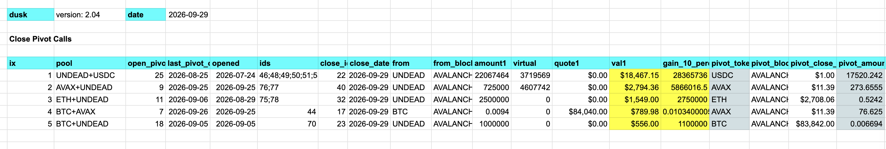

Fundamentals. Testing. "Definition of 'done.'" Coverage.

We can't neglect these in this modern AI era. 

# PIVOTS

## BTC+AVAX

Let's open BTC+AVAX pivots. I open:

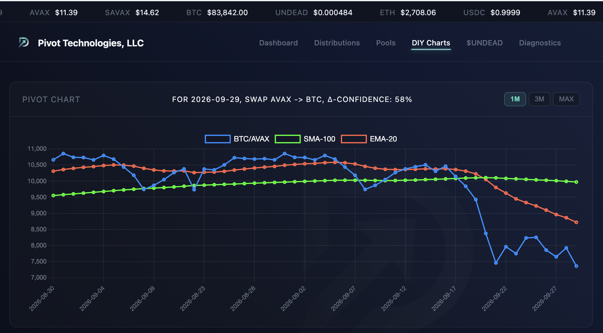
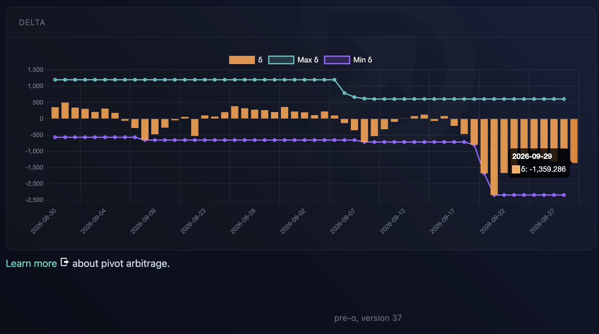
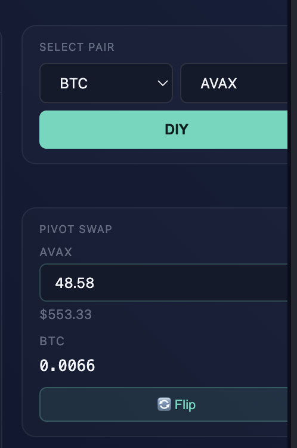
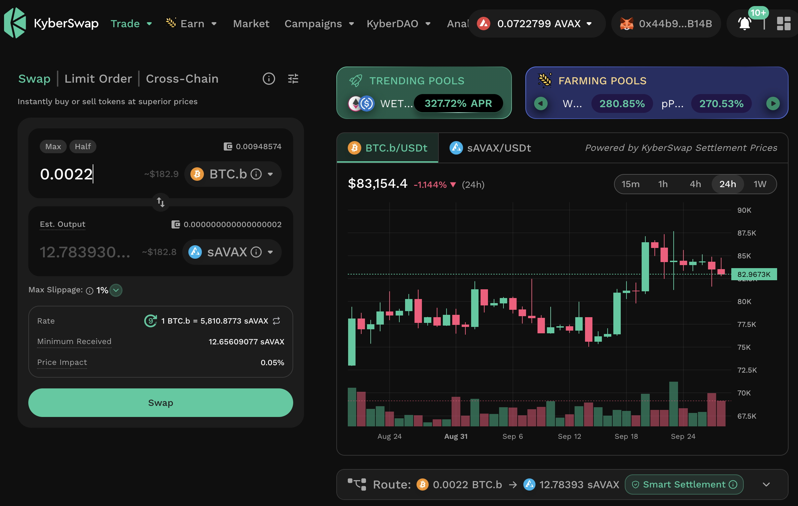

* an AVAX-on-BTC pivot and
* a BTC-on-AVAX hedge

as per [EMA-20 ratio and delta 
indicators](https://pivoteur.github.io/diy.html?t1=BTC&t2=AVAX) provided by 
the Pivot protocol.

## AVAX+UNDEAD

Let's close 2 UNDEAD-on-AVAX pivots for gains of:

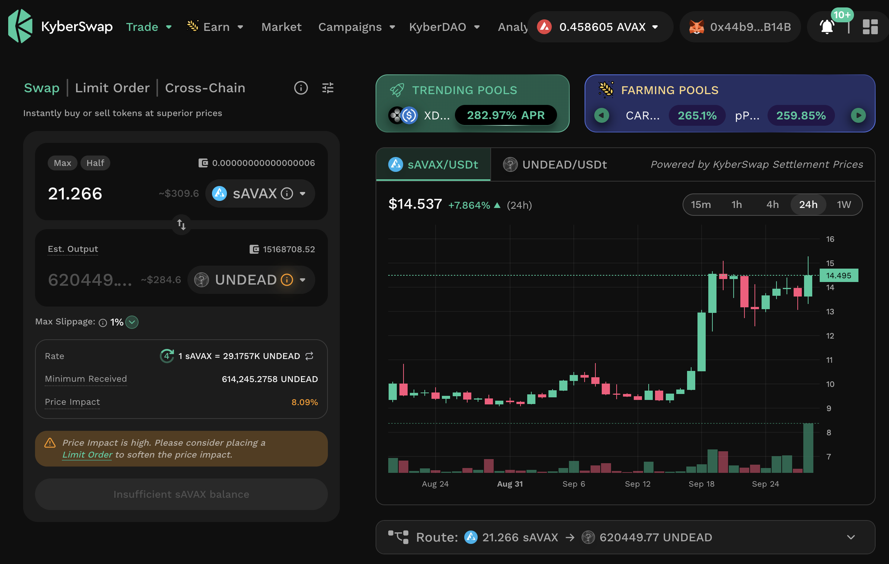

* actual ROI: 14.98% / 1367.05% APR projected 💥

or ~$386.

I distribute and reinvest gains for the investors (this I will do after lunch, 
kthxbai!)

### Let's open new AVAX+UNDEAD pivots

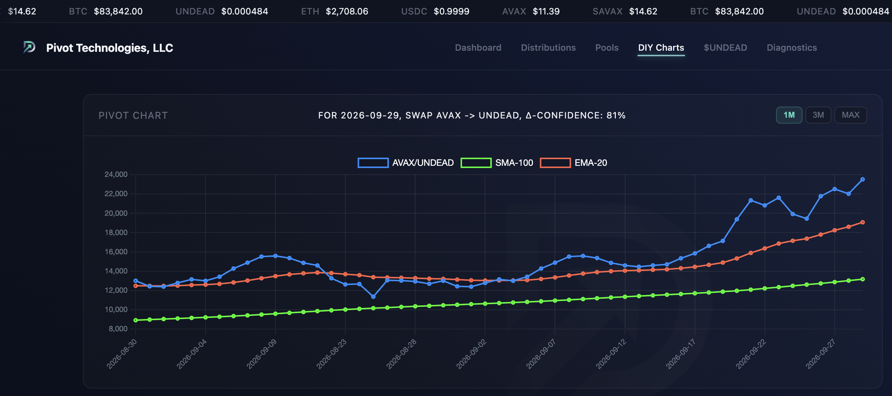
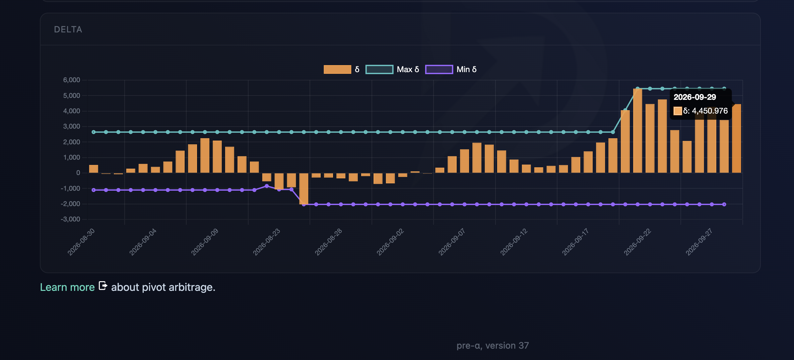
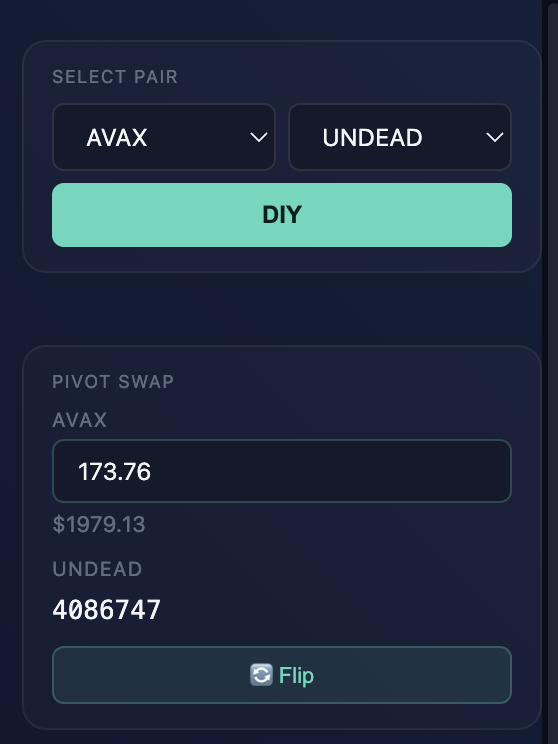
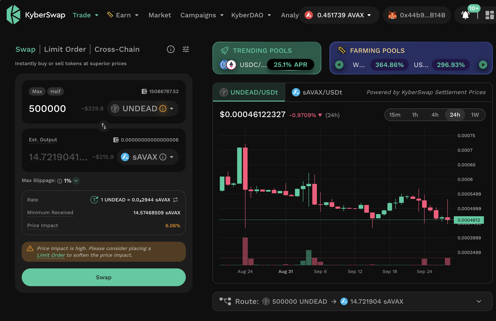

* I open an AVAX-on-UNDEAD pivot and
* an UNDEAD-on-AVAX hedge

as per [Pivot protocol 
indicators](https://pivoteur.github.io/diy.html?t1=AVAX&t2=UNDEAD)

## Also, let's open BTC+UNDEAD pivots

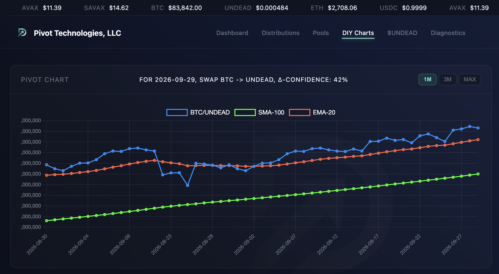
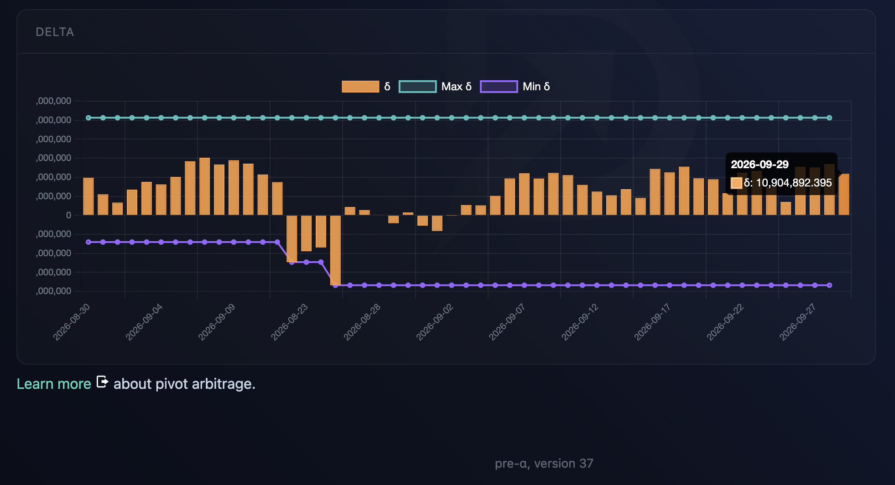
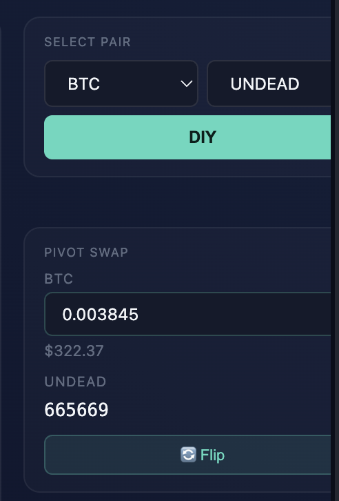
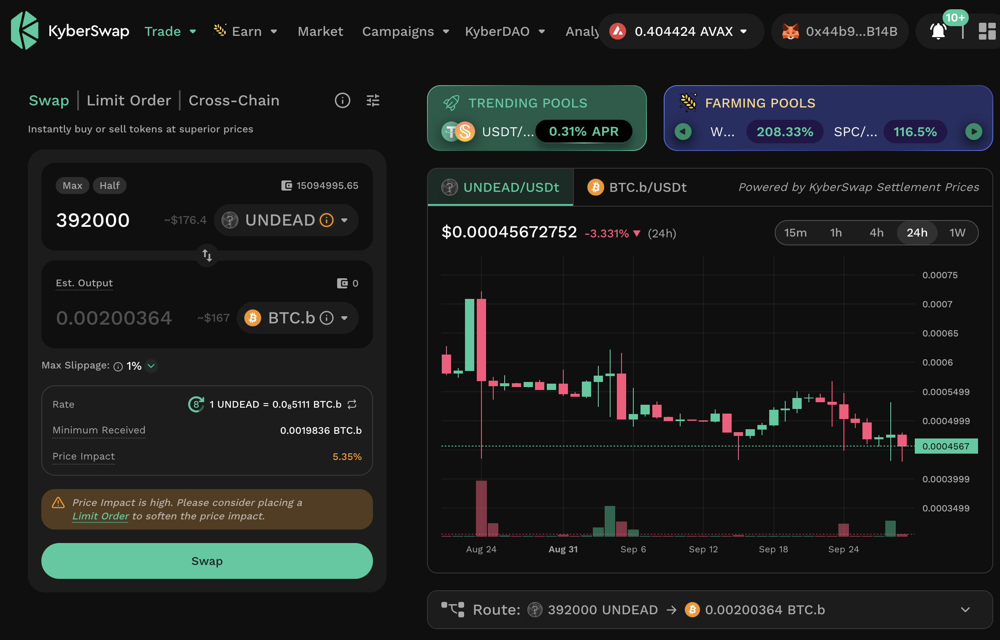

* I open a BTC-on-UNDEAD pivot and
* an UNDEAD-on-BTC hedge

as per [Pivot protocol 
indicators](https://pivoteur.github.io/diy.html?t1=BTC&t2=UNDEAD)
