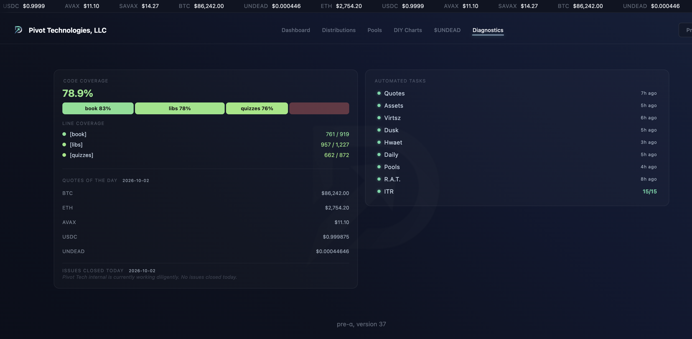
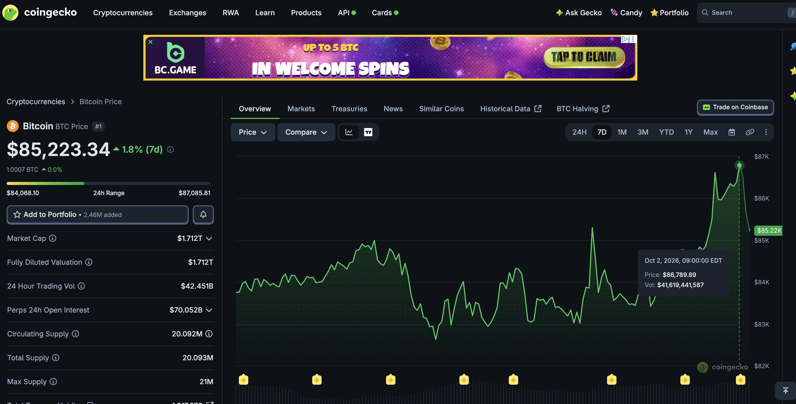
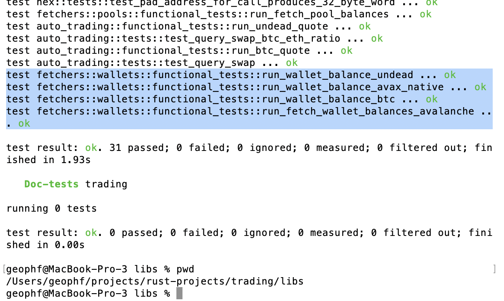

# BTC

HWÆT, pivoteurs, and well-met!

BTC peaked above $86k this morning then dipped hard.

Do you know what that means?

That means I need to turn to and get to WORK!

Because it's today: Friday. A good day to be alive. 

# Testing

My first piece of work: testing.

Currently my tests ping a real wallet on a real blockchain.

I really don't like that.

So, Imma BUIDL me wallet interactions via a proxy, and, for testing, [use the 
proxy to mock the wallet](https://github.com/pivoteur/trading/issues/132).

Design Patterns are Useful.™️ 
