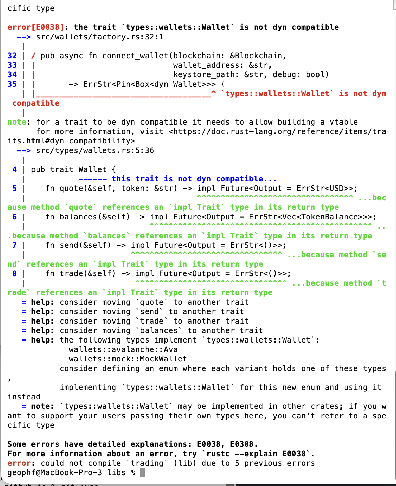
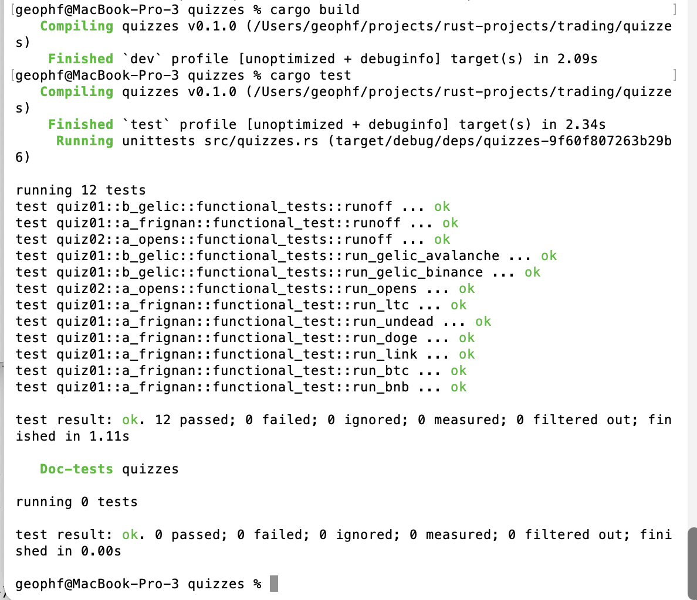

# Development

HWÆT, pivoteurs, and well-met!

I've been fighting the compiler on types.

What's the return-type of a Trait that has functions that return Futures? 

Although allowed by the Rust Language Spec, implementations can be tricky.

I figured out the return-type. It took 2 days. *sigh*
