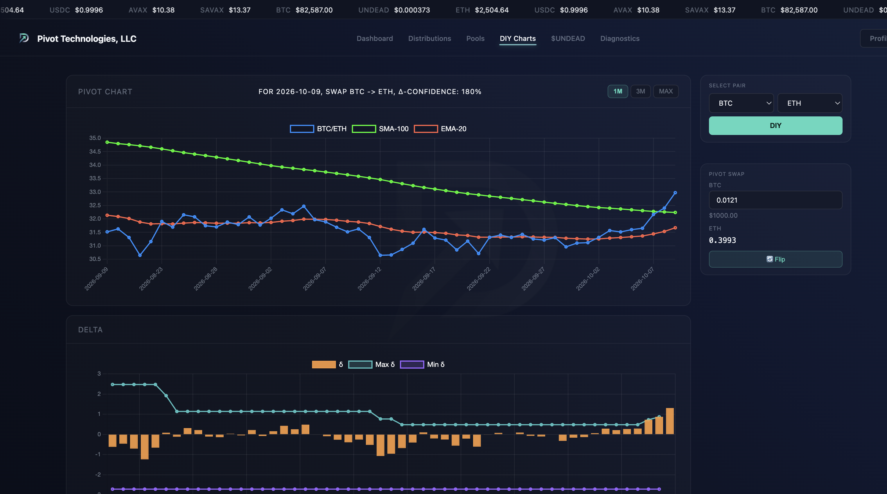

# BTC and automation ( `sendan` )

HWÆT, pivoteurs, and well-met!


Last night, did somebody panic-sell their 10,000 BTC at leverage?

No matter: we pivoteurs make money whether the markets go up or go down.


Meanwhile, [I discovered `sendan` does not send native tokens (AVAX on 
Avalanche)](https://github.com/pivoteur/trading/issues/151).

# Pivot Arbitrage

Replying to a tweet about [excellence not worrying about 
competition](https://x.com/Jayyanginspires/status/2108165794467074118):

Somebody asked me: "But what if somebody copies [pivot arbitrage]?"

Me: "Please do!"



Pivot Arbitrage is the simplest trading technique in the world once discovered 
(by me, btw), but why isn't everybody doing it, and not worrying about what 
the markets do anymore?

I wonder.

# Logic programming with [crepe](https://crates.io/crates/crepe)

[Datalog on Rust](https://github.com/ekzhang/crepe) with procedural macros.

All because I wanted implication à la:

```Rust
token_entry.native ->
   Err("Native token send not supported")
```

As a `sendan` guard (for now).

Huh.

