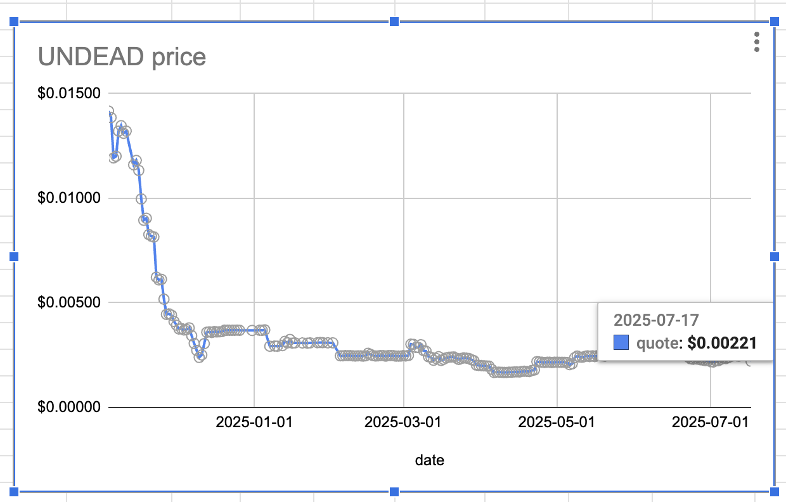

2025-07-17

# Status of $UNDEAD 

 
 
 
 

* rank: 8480 
* quote: $0.00221 
* market cap: $33,187 
* 24-hr volume: $94,618 (δ: -$37,442 ) 

When we get LPs funded on multiple blockchains, what will $UNDEAD look like? 

[$UNDEAD data source](https://www.coingecko.com/en/coins/undead-blocks) 

[The Pivot protocol](https://pivoteur.github.io/#) 
