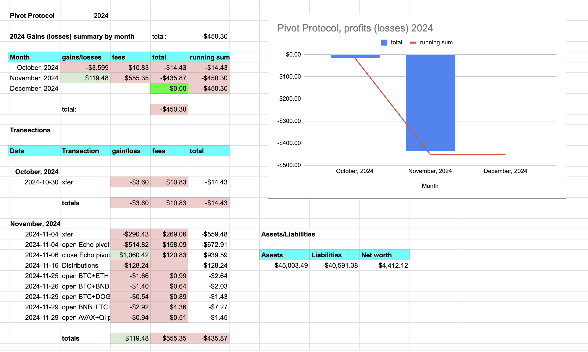
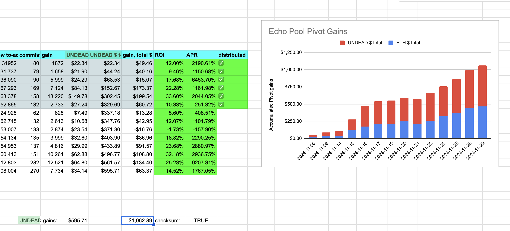
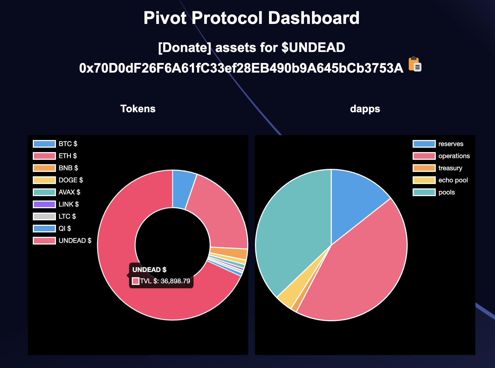
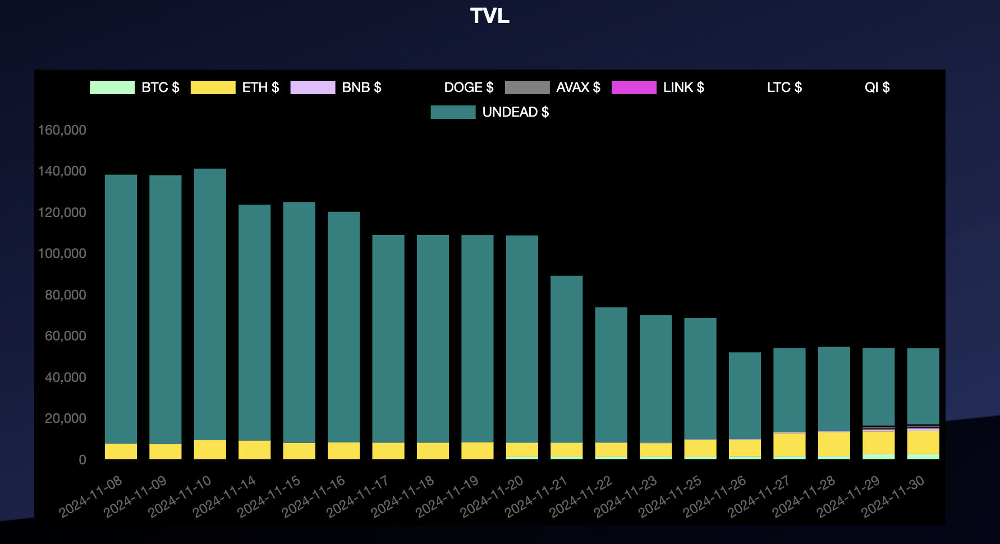

# Pivot Protocol Monthly report for November, 2024 

* The Pivot Protocol gained/(lost) $119.48 
* Was charged fees of: $555.35 
* For a total net gain/(loss) of: -$435.87 

* Year-to-date gains/(losses) are: -$450.30 

## Detail

* Total $UNDEAD sold: 819447
* USD-value: $4,648.76

* Echo pool profit: $1,062.89

other pools haven't pivoted yet, so no profits to record there yet.

Total protocol allocations on pivoteur.github.io and shown here:

