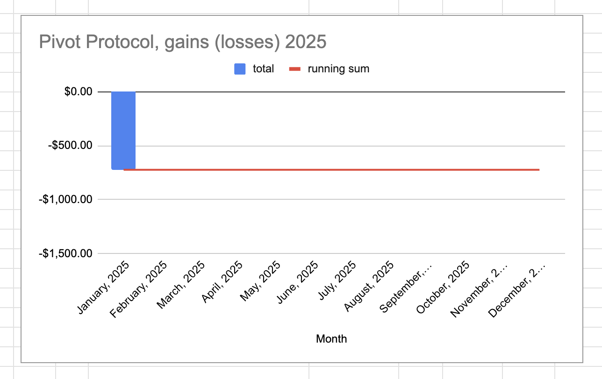
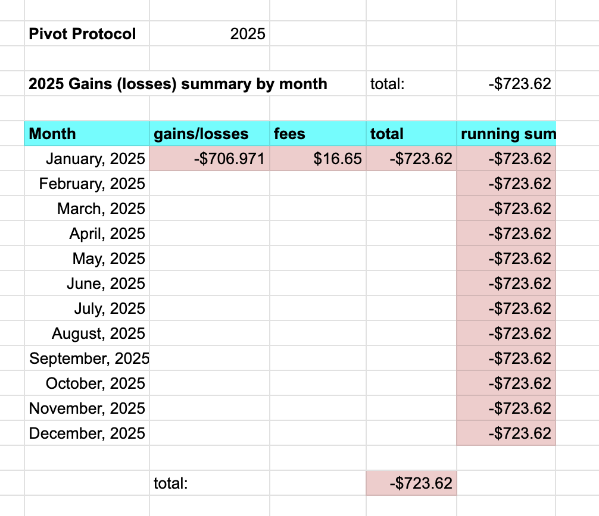
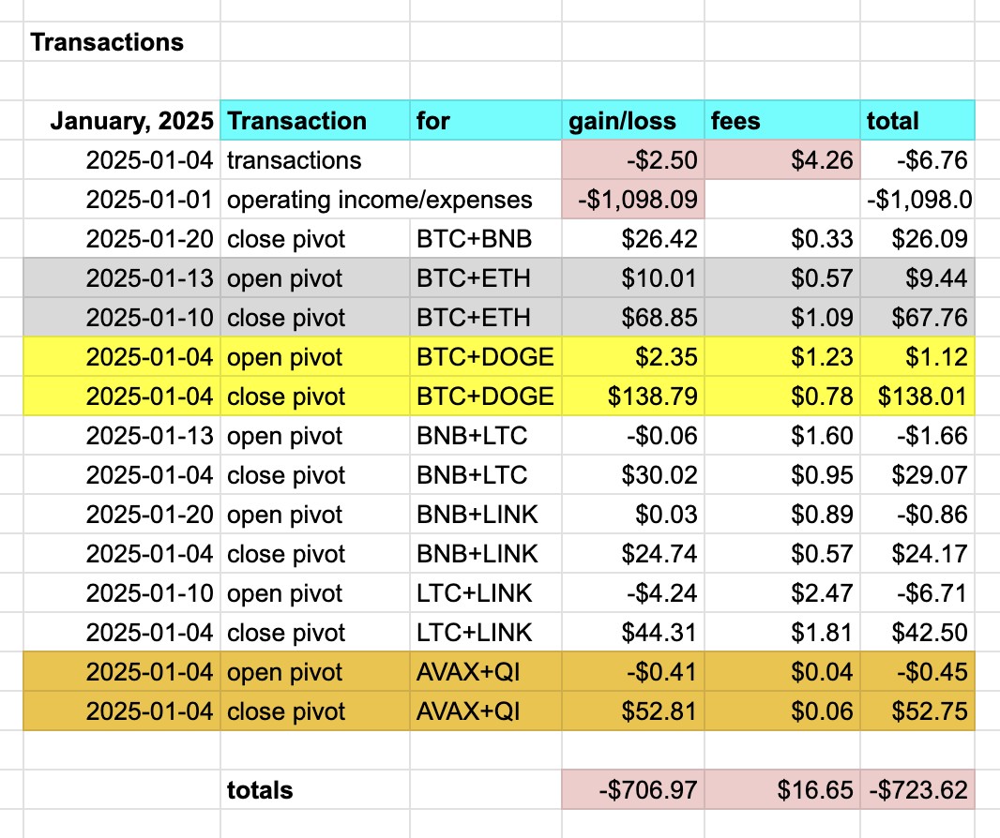

# Pivot Protocol Monthly report for January, 2025 

* The Pivot Protocol gained/(lost) -$706.971 
* Was charged fees of: $16.65 
* For a total net gain/(loss) of: -$723.622 

* Year-to-date gains/(losses) are: -$723.62 

# Top 3 Pivot-gainers, January, 2025 

1. BTC+DOGE $139.13 
2. BTC+ETH $77.20 
3. AVAX+QI $52.30 

total gains for all pivot pools, January, 2025: $381.23 

