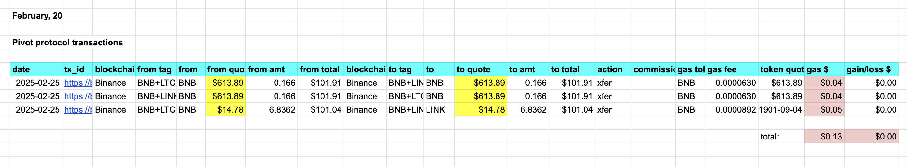
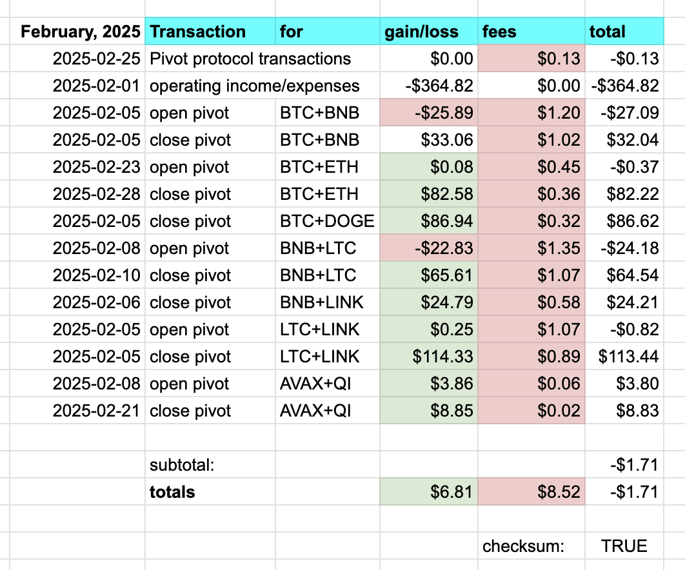
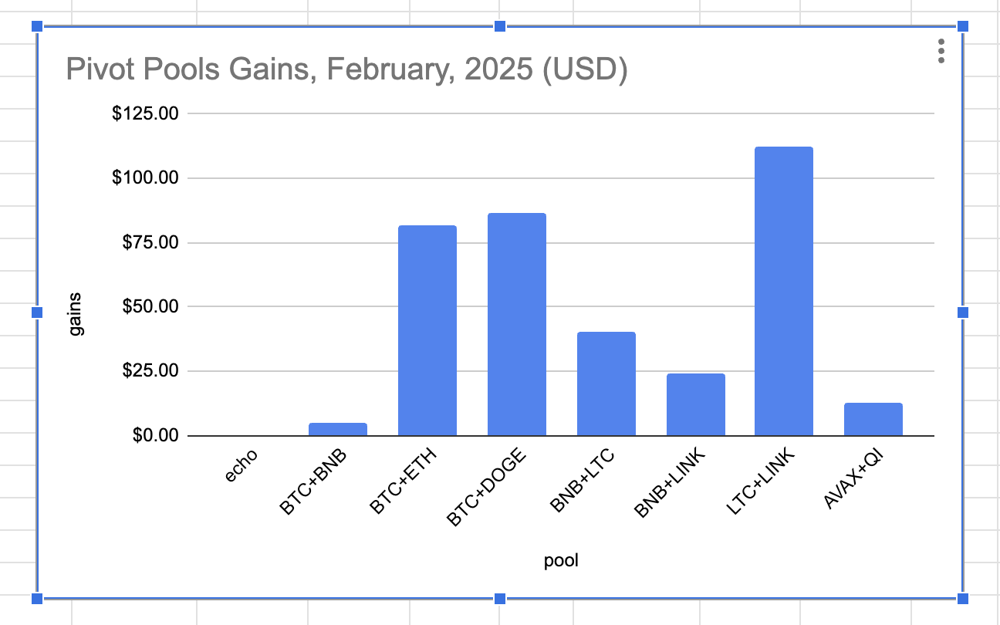

# Pivot Protocol Monthly report for February, 2025 

* The Pivot Protocol gained/(lost): $0.00 
* Was charged fees of: $0.13 
* For a total net gain/(loss) of: -$0.13 
* Year-end gains/(losses) are: -$725.33 

# UNDEAD February, 2025 

* UNDEAD sold: 0 
* UNDEAD bought 0 

# Top-3 Pivot Pool gains February, 2025 

1. LTC+LINK $112.62 
2. BTC+DOGE $86.62 
3. BTC+ETH $81.85 

Total pivot gains, February, 2025 : $363.24 

# Conclusion

Lots of activity to break even this month, which is a good thing, actually, as gains matched operational expenses.
