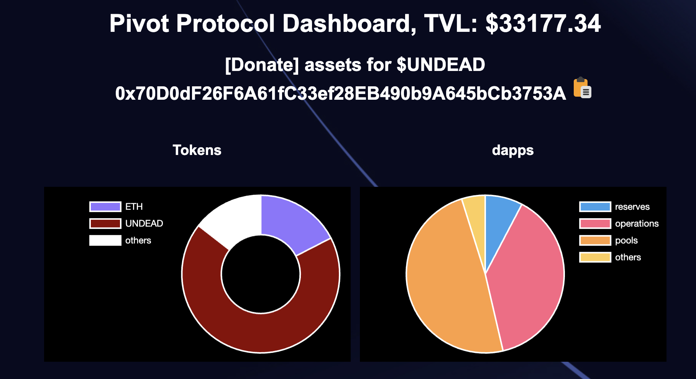
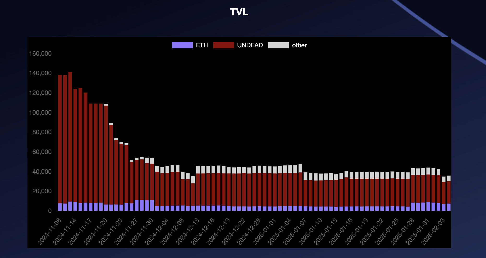

# 2025 Reports

* [February, 2025](02)
* [January, 2025](01)

# Year-to-date report

# Assets/Liabilities 

* Assets $44,145.65 
* Liabilities -$42,888.17 
* Net worth $1,257.48 

# UNDEAD 

* UNDEAD sold: 0 
* UNDEAD bought 0 

# Per-pool gains/(losses) for 2025 YTD 

* echo $0.00 
* BTC+BNB $26.09 
* BTC+ETH $77.20 
* BTC+DOGE $139.13 
* BNB+LTC $27.41 
* BNB+LINK $23.31 
* LTC+LINK $35.79 
* AVAX+QI $52.30 

total pivot gains: $381.23 

