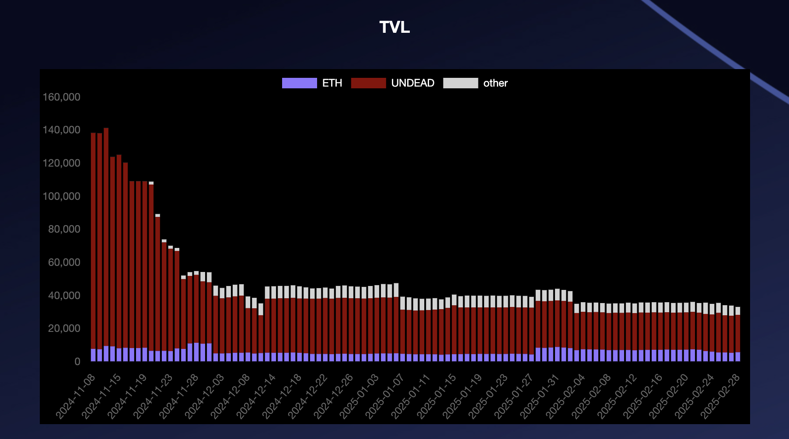

# 2025 Reports

* [February, 2025](02)
* [January, 2025](01)

# Pivot Protocol Report YTD, 2025 

* Assets $44,145.65 
* Liabilities -$42,888.17 
* Net worth $1,257.48 

# TVL YTD, 2025 

* Pools $16,185.57 
* operations $12,832.46 
* reserves $2,552.15 
* others $1,607.16 

# UNDEAD 

* UNDEAD sold: 0 
* UNDEAD bought 0 

# Pivot Protocol pools 2025 YTD 

* total pivot gains: $744.47 

* echo $0.00 
* BTC+BNB $31.04 
* BTC+ETH $159.05 
* BTC+DOGE $225.75 
* BNB+LTC $67.77 
* BNB+LINK $47.52 
* LTC+LINK $148.41 
* AVAX+QI $64.93 

